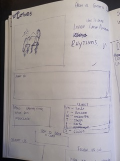
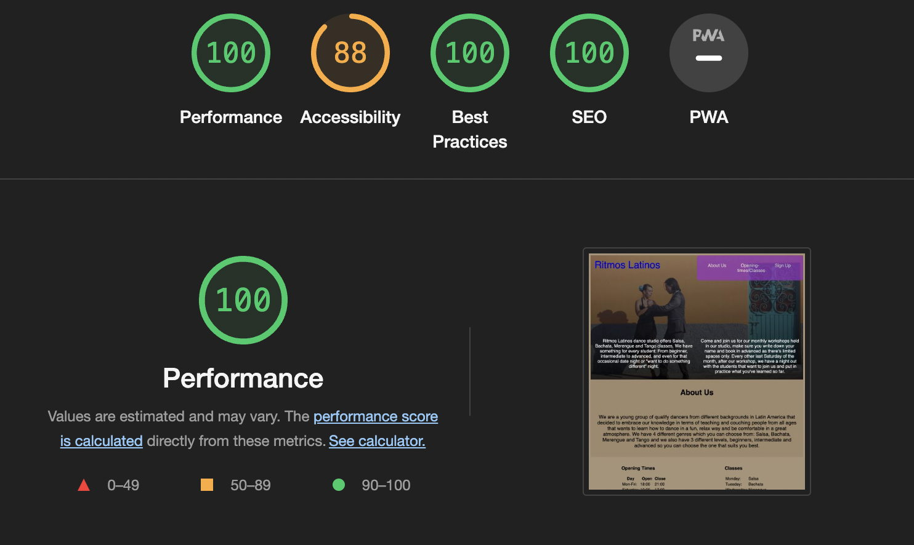

PORTFOLIO PROJECT - 1

RITMOS LATINOS

PURPOSE

Ritmos Latinos website is created buy a young group of individuals that wants to put their dancing skills to a higher level
giving the opportunity to all range of people and ages.

FINAL RESULT

THE MAIN IDEA 

My initial idea for the project was to create a website to informed and coach people on different kinds of Latin rhythms . My target audience is anyone who is interested in how to learn to dance some of the most well-known genres looking for a warm and fun enviroment. This can be any person of any age, gender and interest level. 

The Features I wanted the project to have are:

To make the site easy to read.
Have an easy to navigate "Nav Bar".
To keep it as simple as possible.

CONTENTS

UX/UI

This website was created to show my knowledge of HTML and CSS and to provide users with visual and interaction content.
The site should be easy and simple to navigate.
The site should be easy to read and to understand the purposed of it.

Site Goals:

To put in practise that I understand the basic skills to used HTML and CSS.
To give users an easy way to understand and easy way to navigate the website.
To give users enough information to come back to the website for them to join our community.
To make the site easily accessible from any device.

WIREFRAMES

 

FEATURES

The website consists of the following:

1 single page website with a header (title) and Navbar  ABOUT US, OPENINGTIMES/CLASSES, SIGN UP.
Main content has a background image and text and footer with social media logos/links.

IMAGES

The background image come from the following website [PEXELS](https://www.pexels.com/)

TYPOGRAPHY

I chosen "Lucida Sans", sans-serif as my Font-family (still not sure if that is going to be the final option)

TESTING

The site has been tested through different device sizes.
Tested the website in different browsers.

DEVICES

I've tested responsiveness and functionality on the following devices and browsers:
Android:
Samsung Galaxy S8+
Samsung Galaxy S20 Ultra
Galaxy Fold
Samsung Galaxy A51/71
Apple:
Ipad mini
Ipad Air
Iphone SE
Iphone XR
Iphone 12 PRO
laptops:
MacBook Pro 16"
Browsers:
Chrome
Firefox
Safari

VALIDATORS

CSS Validator cheched and passed.

HTML Validator checked and passed.
See below for HTML Validator results.

Lighthouse checked and passed.

3 lighthouse errors remain for accesibility with a score of 88.

SOLVED BUGS AND ERRORS

Kept having an error of the image but find that I had 2 image file paths.

UNSOLVED BUGS AND ERRORS

This warning is because in the above lines it was a patern of 3 rows and that one has only 2.
This warning does not affect the functionality of the webpage.

Have 3 empty form label errors when checking the site on webaim.org.
Have 4 errors for the Fontawesome logos in the footer.

FUNCTIONALITY

All links have been hovered over and clicked on to ensure accessibility.
Pages all load correctly on all device screen sizes.
All Social media links work correctly and open on a new tab.

TECHNOLOGIES USED

HTML and CSS.

PROGRAMS USED

GIT
For version control, commiting and pushing to github.
GITPOD
The IDE used to code this website.
GITHUB
Used to store repositories, files and images pushed from gitpod.
AM I RESPONSIVE.
Used to test responsiveness of the website at different screen sizes.
CHROME DEVELOPER TOOLS
For checking compatibilty, troubleshooting and editing code.
GOOGLE
Used for the social media links in the footer of each page.

CREDITS

Mike Dane Youtuber Software Developer.
Kevin Powell Youtuber Software Developer (The king of CSS).
Antonio Rodriguez my mentor.
Chris williams from slack for his help and guidance.
Submit button idea from Code Institute (Coders Coffeehouse).
Examples from Love Runing Project
W3Schools
YouTube
Stackoverflow
Student care, Tutors and the Slack community